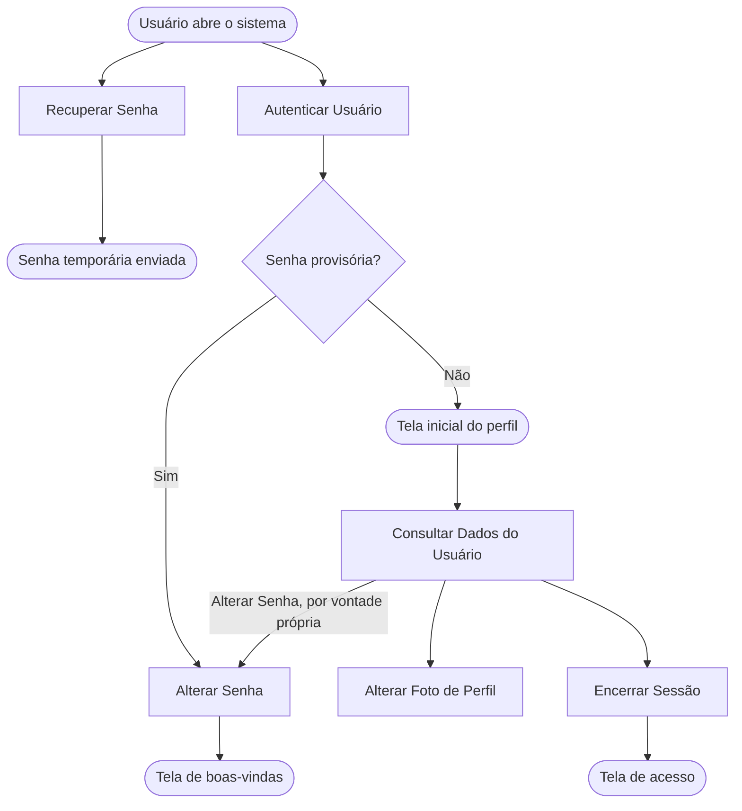

<!-- docqui: 3.0.1 | prompt: PROMPT_CONVERSION | atualizado: 2026-09-30 -->
# Feature Set: Autenticação
> **Nível 2** - Major Feature Set: Acesso e Usuários - `ACE-AUT`

## Descrição

Reúne o que o usuário faz com a própria conta: entrar no sistema com usuário e senha, sair, pedir uma senha temporária quando esquece a sua, trocar a senha — por obrigação, no primeiro acesso, ou por vontade própria —, ver os dados com que está logado e trocar a foto de perfil. Todas as operações são feitas sobre o cadastro corporativo da CNI. Corresponde ao documento legado **GPE001 – Efetuar Login**.

**Não faz**: a manutenção dos usuários por um administrador (Feature Set Usuários), a definição do menu e do que cada perfil pode executar (cadastro corporativo da CNI) e qualquer conteúdo na tela inicial além da saudação — o item de menu se chama Dashboard, mas a tela não traz indicador nenhum 💻.

---

## Features

| Feature | Descrição |
|---|---|
| [**Autenticar Usuário**](f-autenticar-usuario.md) <small>ACE-AUT-01</small> | Entrar no sistema com usuário e senha e chegar à tela inicial do perfil |
| [**Encerrar Sessão**](f-encerrar-sessao.md) <small>ACE-AUT-02</small> | Sair do sistema, voltando à tela de acesso |
| [**Recuperar Senha**](f-recuperar-senha.md) <small>ACE-AUT-03</small> | Pedir, pelo login, o envio de uma senha temporária |
| [**Alterar Senha**](f-alterar-senha.md) <small>ACE-AUT-04</small> | Definir uma nova senha — obrigatoriamente no primeiro acesso, ou a qualquer momento pelo menu do usuário |
| [**Alterar Foto de Perfil**](f-alterar-foto-perfil.md) <small>ACE-AUT-05</small> | Trocar a imagem que identifica o usuário no cabeçalho ⚠️ a tela atual não abre a troca |
| [**Consultar Dados do Usuário**](f-consultar-dados-usuario.md) <small>ACE-AUT-06</small> | Ver nome, login, perfil e e-mail do usuário logado |

---

## Fluxo Principal

---

## Dependências entre features

- **Autenticar Usuário** é pré-requisito de todas as outras, exceto de **Recuperar Senha**, que parte da tela de acesso sem sessão aberta.
- **Alterar Senha** tem duas entradas. Na obrigatória, é a própria autenticação que desvia para ela quando a senha em uso é provisória — a senha recebida por e-mail na inclusão do usuário ou na recuperação. Na voluntária, o usuário já logado a abre pelo menu do usuário.
- **Recuperar Senha** termina com o envio de uma senha temporária; o usuário volta à tela de acesso, autentica-se com ela e cai na troca obrigatória de **Alterar Senha**. 🔍
- **Consultar Dados do Usuário**, **Alterar Foto de Perfil** e **Encerrar Sessão** estão no mesmo menu suspenso do cabeçalho, presente em todas as telas internas.
- A tela inicial depende do perfil: Secretaria Mesa e Secretaria Check-In vão direto para os participantes do evento principal (Feature Set [Participantes](../../eventos/participantes/README.md)); todos os demais perfis vão para a tela de boas-vindas. 💻
- ⚠️ Depois de **Alterar Senha**, o destino é sempre a tela de boas-vindas, qualquer que seja o perfil — inclusive os de secretaria, que na autenticação comum iriam para os participantes do evento principal 💻.

---

## Telas

| Tela | Rota sugerida | Features atendidas | Descrição |
|---|---|---|---|
| Acesso | `/login` | **Autenticar Usuário** <small>ACE-AUT-01</small> | Usuário, senha, botão Entrar e o atalho "Esqueceu a senha?" |
| Recuperar senha | `/recuperar-senha` | **Recuperar Senha** <small>ACE-AUT-03</small> | Login e botão Recuperar senha |
| Alterar senha | `/alterar-senha` | **Alterar Senha** <small>ACE-AUT-04</small> | Senha atual, nova senha e confirmação; na troca obrigatória, a senha atual não é pedida |
| Menu do usuário | cabeçalho de todas as telas internas | **Consultar Dados do Usuário** <small>ACE-AUT-06</small> **Alterar Foto de Perfil** <small>ACE-AUT-05</small> **Encerrar Sessão** <small>ACE-AUT-02</small> | Foto e nome do usuário; ao abrir, mostra os dados e os atalhos Alterar Foto do Perfil, Alterar Senha e Logout |
| Tela inicial | `/dashboard-simples` | — | Saudação "Seja bem-vindo ao Gestão de Participantes em Eventos"; não atende nenhuma feature |

---

## Permissões por perfil

> **Fonte única de permissões** deste Feature Set. As features (N3) não tratam de
> perfis nem permissões — qualquer acesso novo ou diferente entra nesta matriz.

Perfis: **Administrador**, **Secretaria Mesa**, **Secretaria Check-In**.

| Perfil | Autenticar | Encerrar Sessão | Recuperar Senha | Alterar Senha | Alterar Foto | Consultar Dados |
|---|---|---|---|---|---|---|
| **Administrador** | ✓ | ✓ | ✓ | ✓ | ✓ | ✓ |
| **Secretaria Mesa** | ✓ | ✓ | ✓ | ✓ | ✓ | ✓ |
| **Secretaria Check-In** | ✓ | ✓ | ✓ | ✓ | ✓ | ✓ |

* **Todos os perfis** — o que é da própria conta está disponível a qualquer usuário. GPE001 só traz na matriz Efetuar Login e Efetuar Logout 📄; as demais colunas vêm do código, que não distingue perfil em nenhuma delas 💻.
* **Recuperar Senha** não exige sessão aberta: está na matriz porque qualquer usuário, de qualquer perfil, pode usá-la — não porque o sistema confira o perfil.
* ⚠️ Os perfis **Painel** e **Participante** existem no cadastro corporativo do sistema e também se autenticam; depois de entrar, só têm o item Dashboard no menu 💻.

---

## Changelog

<!-- Ordem decrescente por data: a entrada mais recente fica sempre no topo, logo abaixo do cabeçalho. -->

| Data | Autor | Tipo | Descrição |
|---|---|---|---|
| 2026-09-30 | Claude (analista-requisitos) | N2 criado | Engenharia reversa do documento legado GPE001 – Efetuar Login (v1.0, 03/10/2025) e do código das telas de acesso |

---

*Links: [N1 do domínio](../README.md) · [INDEX geral](../../INDEX.md)*
