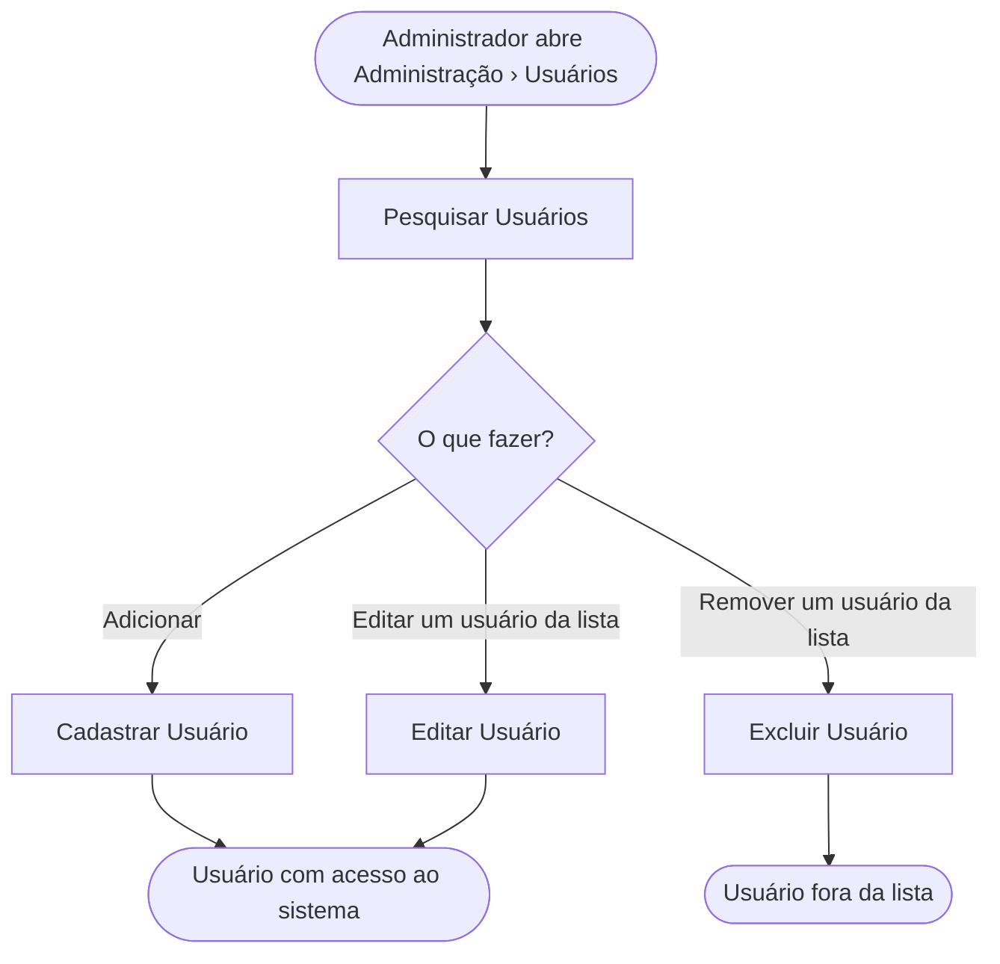

<!-- docqui: 3.0.1 | prompt: PROMPT_CONVERSION | atualizado: 2026-09-30 -->
# Feature Set: Usuários
> **Nível 2** - Major Feature Set: Acesso e Usuários - `ACE-USU`

## Descrição

Reúne a manutenção dos usuários do sistema pelo Administrador: localizar um usuário, incluí-lo a partir da validação do seu login, alterar seus dados e seu perfil, e excluí-lo. O usuário é mantido no cadastro corporativo da CNI — a tela do GPE opera sobre ele e define o perfil que a pessoa terá neste sistema. Corresponde ao documento legado **GPE002 – Manter Usuário**.

**Não faz**: a autenticação e a troca de senha do próprio usuário (Feature Set Autenticação), a criação de perfis e a definição do que cada perfil pode executar (cadastro corporativo da CNI), a inativação do usuário — a situação Ativo ou Inativo é exibida, mas a tela não tem ação para alterá-la 💻 — e o cadastro das pessoas convidadas para os eventos (domínio Pessoas).

---

## Features

| Feature | Descrição |
|---|---|
| [**Pesquisar Usuários**](f-pesquisar-usuarios.md) <small>ACE-USU-01</small> | Localizar usuários por entidade, perfil, nome ou login e ver os dados de cada um |
| [**Cadastrar Usuário**](f-cadastrar-usuario.md) <small>ACE-USU-02</small> | Incluir um usuário a partir do login validado, com seus dados e o perfil de acesso |
| [**Editar Usuário**](f-editar-usuario.md) <small>ACE-USU-03</small> | Alterar os dados e o perfil de um usuário, mantendo o login |
| [**Excluir Usuário**](f-excluir-usuario.md) <small>ACE-USU-04</small> | Retirar o usuário do sistema, que deixa de exibi-lo |

---

## Fluxo Principal

---

## Dependências entre features

- **Cadastrar Usuário**, **Editar Usuário** e **Excluir Usuário** partem da tela de **Pesquisar Usuários**: o botão Adicionar abre o cadastro, e as ações de cada linha abrem a edição e a exclusão.
- **Cadastrar Usuário** e **Editar Usuário** usam o mesmo formulário. O cadastro começa pela validação do login; a edição abre com o login já fixado e os dados preenchidos.
- Depois de incluído, o usuário recebe por e-mail uma senha provisória 📄 e, ao autenticar-se com ela, é levado à troca obrigatória — features **Autenticar Usuário** `ACE-AUT-01` e **Alterar Senha** `ACE-AUT-04` do Feature Set [Autenticação](../autenticacao/README.md). ⚠️ O envio é feito pelo cadastro corporativo; o código do GPE não o dispara nem o confirma.

---

## Telas

| Tela | Rota sugerida | Features atendidas | Descrição |
|---|---|---|---|
| Usuários | `/administracao-usuarios` | **Pesquisar Usuários** <small>ACE-USU-01</small> **Excluir Usuário** <small>ACE-USU-04</small> | Filtros, lista de usuários e as ações Editar Usuário e Remover Usuário em cada linha |
| Usuário | `/administracao-usuario` (inclusão, antes de validar o login) e `/administracao-usuario/:login` (inclusão com o login validado, e edição) | **Cadastrar Usuário** <small>ACE-USU-02</small> **Editar Usuário** <small>ACE-USU-03</small> | Login com o botão Validar Login, dados do usuário, perfil de acesso e instituições relacionadas |

---

## Permissões por perfil

> **Fonte única de permissões** deste Feature Set. As features (N3) não tratam de
> perfis nem permissões — qualquer acesso novo ou diferente entra nesta matriz.

Perfis: **Administrador**, **Secretaria Mesa**, **Secretaria Check-In**.

| Perfil | Pesquisar | Cadastrar | Editar | Excluir |
|---|---|---|---|---|
| **Administrador** | ✓ | ✓ | ✓ | ✓ |
| **Secretaria Mesa** | — | — | — | — |
| **Secretaria Check-In** | — | — | — | — |

* **Administrador** — único perfil com acesso à manutenção de usuários, conforme GPE002.
* ⚠️ O que impede os demais perfis é o **menu**, que só traz Administração › Usuários para o Administrador. A tela em si não confere o perfil: um usuário autenticado de outro perfil que digite o endereço chega a ela 💻. Se as operações de inclusão, alteração e exclusão são recusadas pelo cadastro corporativo nesse caso, o código do GPE não permite confirmar ❓.

---

## Changelog

<!-- Ordem decrescente por data: a entrada mais recente fica sempre no topo, logo abaixo do cabeçalho. -->

| Data | Autor | Tipo | Descrição |
|---|---|---|---|
| 2026-09-30 | Claude (analista-requisitos) | N2 criado | Engenharia reversa do documento legado GPE002 – Manter Usuário (v1.0, 03/10/2025) e do código das telas de usuários |

---

*Links: [N1 do domínio](../README.md) · [INDEX geral](../../INDEX.md)*
