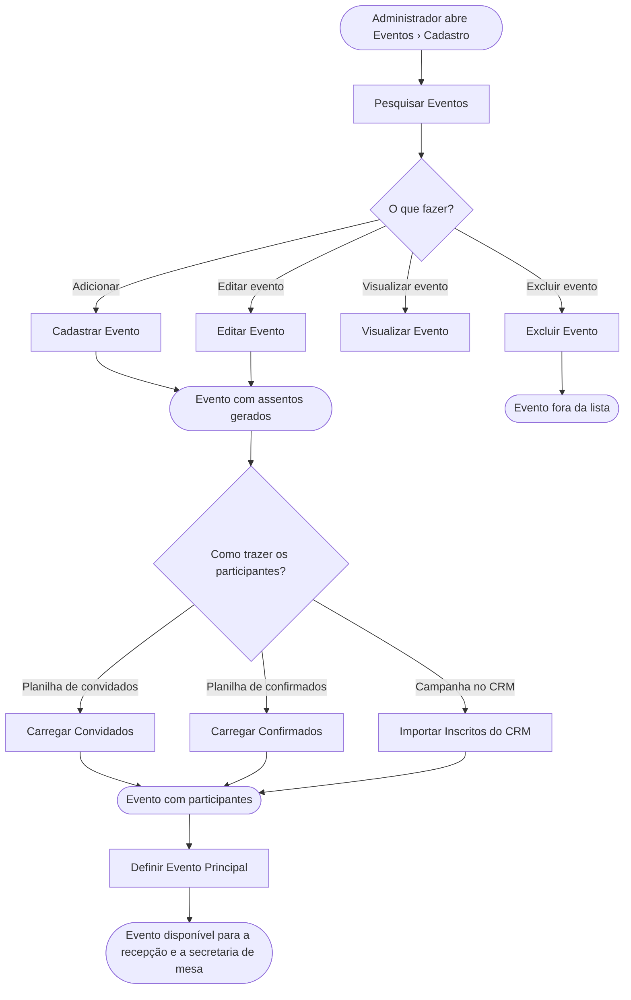

<!-- docqui: 3.0.1 | prompt: PROMPT_CONVERSION | atualizado: 2026-09-30 -->
# Feature Set: Cadastro de Eventos
> **Nível 2** - Major Feature Set: Eventos - `EVT-CAD`

## Descrição

Reúne a manutenção dos eventos e a formação da lista de participantes de cada um. O Administrador localiza um evento, inclui, altera, visualiza e exclui; define qual é o evento principal, aquele sobre o qual a recepção e a secretaria de mesa trabalham; e traz para o evento as pessoas — por planilha de convidados, por planilha de confirmados ou importando do CRM os inscritos da campanha. Corresponde ao documento legado **GPE004 – Manter Evento**.

**Não faz**: a gestão dos participantes depois que entram no evento — pesquisa, check-in, legenda e mapa de assentos (Feature Set Participantes) —, a configuração das legendas do evento (Feature Set Legendas), o cadastro de tipos de evento e de tipos de mesa, que são listas mantidas fora das telas 💻, e a alteração dos assentos do evento, que nascem com ele em quantidade fixa por tipo de mesa.

---

## Features

| Feature | Descrição |
|---|---|
| [**Pesquisar Eventos**](f-pesquisar-eventos.md) <small>EVT-CAD-01</small> | Localizar eventos por nome, local, tipo, formato da mesa ou período, e acessar a gestão de cada um |
| [**Cadastrar Evento**](f-cadastrar-evento.md) <small>EVT-CAD-02</small> | Incluir um evento com nome, data, local, tipo, formato da mesa e quantidade de participantes, gerando os assentos do mapa |
| [**Editar Evento**](f-editar-evento.md) <small>EVT-CAD-03</small> | Alterar os dados básicos de um evento |
| [**Visualizar Evento**](f-visualizar-evento.md) <small>EVT-CAD-04</small> | Ver os dados básicos de um evento sem poder alterá-los |
| [**Excluir Evento**](f-excluir-evento.md) <small>EVT-CAD-05</small> | Retirar o evento da lista, mantendo seus dados guardados |
| [**Definir Evento Principal**](f-definir-evento-principal.md) <small>EVT-CAD-06</small> | Marcar o evento que fica disponível para o check-in e a recepção dos convidados |
| [**Carregar Convidados**](f-carregar-convidados.md) <small>EVT-CAD-07</small> | Trazer de uma planilha a lista de convidados, cadastrando as pessoas e vinculando-as ao evento |
| [**Carregar Confirmados**](f-carregar-confirmados.md) <small>EVT-CAD-08</small> | Trazer de uma planilha a lista de quem confirmou presença, marcando a confirmação no evento |
| [**Importar Inscritos do CRM**](f-importar-inscritos-crm.md) <small>EVT-CAD-09</small> | Buscar no CRM os inscritos aprovados e confirmados da campanha do evento e vinculá-los a ele 💻 |

---

## Fluxo Principal

---

## Dependências entre features

- Todas as demais features partem da tela de **Pesquisar Eventos**: Adicionar abre o cadastro, e os ícones de cada linha levam a visualizar, editar, excluir, definir como principal e à janela de cargas.
- **Cadastrar Evento**, **Editar Evento** e **Visualizar Evento** usam o mesmo formulário; visualizar o abre só para leitura.
- **Cadastrar Evento** gera os assentos do mapa conforme o tipo de mesa. ⚠️ **Editar Evento** não os refaz: trocar o tipo de mesa de um evento já incluído deixa o mapa com os assentos do tipo anterior 💻.
- **Carregar Convidados**, **Carregar Confirmados** e **Importar Inscritos do CRM** ficam na mesma janela, Cargas de Convidados e Confirmados. As duas planilhas podem ser anexadas juntas, e a de convidados é enviada antes. ⚠️ Pela leitura do código, quando as duas estão anexadas a de confirmados **não chega a ser enviada** 🔍 — a janela se fecha e esvazia os anexos antes do segundo envio. É o que o Jira descreve em `PDTIC25148-33`, *Erro ao carregar convidados e confirmados ao mesmo tempo*, ainda em aberto.
- **Importar Inscritos do CRM** depende de o evento ter o Código da Campanha, informado em **Cadastrar Evento** ou **Editar Evento**.
- As três formas de trazer participantes gravam também no domínio Pessoas: criam a pessoa que ainda não existe e atualizam a que já existe, reconhecida pelo `Cód. Contato`.
- **Definir Evento Principal** é o que libera o evento para a Secretaria Check-In e a Secretaria Mesa, no Feature Set [Participantes](../participantes/README.md).
- Da mesma lista de eventos saem os atalhos para os participantes do evento (Feature Set Participantes) e para a configuração de legendas (Feature Set [Legendas](../legendas/README.md)).

---

## Telas

| Tela | Rota sugerida | Features atendidas | Descrição |
|---|---|---|---|
| Eventos | `/eventos` | **Pesquisar Eventos** <small>EVT-CAD-01</small> **Excluir Evento** <small>EVT-CAD-05</small> **Definir Evento Principal** <small>EVT-CAD-06</small> | Filtros, lista de eventos e os ícones de ação de cada linha |
| Evento | `/eventos/detail` (inclusão), `/eventos/detail/edit/:id` (edição) e `/eventos/detail/view/:id` (visualização) | **Cadastrar Evento** <small>EVT-CAD-02</small> **Editar Evento** <small>EVT-CAD-03</small> **Visualizar Evento** <small>EVT-CAD-04</small> | Formulário do evento |
| Cargas de Convidados e Confirmados | janela sobre a tela Eventos | **Carregar Convidados** <small>EVT-CAD-07</small> **Carregar Confirmados** <small>EVT-CAD-08</small> **Importar Inscritos do CRM** <small>EVT-CAD-09</small> | Seleção das duas planilhas, botão Enviar e a seção Inscritos do CRM |

---

## Permissões por perfil

> **Fonte única de permissões** deste Feature Set. As features (N3) não tratam de
> perfis nem permissões — qualquer acesso novo ou diferente entra nesta matriz.

Perfis: **Administrador**, **Secretaria Mesa**, **Secretaria Check-In**.

| Perfil | Pesquisar | Cadastrar | Editar | Visualizar | Excluir | Definir Principal | Carregar Convidados | Carregar Confirmados | Importar do CRM |
|---|---|---|---|---|---|---|---|---|---|
| **Administrador** | ✓ | ✓ | ✓ | ✓ | ✓ | ✓ | ✓ | ✓ | ✓ |
| **Secretaria Mesa** | — | — | — | — | — | — | — | — | — |
| **Secretaria Check-In** | — | — | — | — | — | — | — | — | — |

* **Administrador** — único perfil com acesso ao cadastro de eventos, conforme GPE004.
* ⚠️ **As camadas de controle não coincidem** 💻. O menu só traz Eventos › Cadastro para o Administrador. Na tela, apenas o botão Adicionar confere o perfil — e o libera para Administrador e para um perfil **Gestor**, que não existe no cadastro corporativo do sistema; os ícones de cada linha (editar, excluir, definir como principal, cargas) não conferem perfil nenhum. No servidor, a consulta de eventos está declarada para os três perfis e toda inclusão, alteração e exclusão, só para o Administrador — é o servidor, portanto, que sustenta esta matriz.

---

## Changelog

<!-- Ordem decrescente por data: a entrada mais recente fica sempre no topo, logo abaixo do cabeçalho. -->

| Data | Autor | Tipo | Descrição |
|---|---|---|---|
| 2026-09-30 | Claude (analista-requisitos) | N2 criado | Engenharia reversa do documento legado GPE004 – Manter Evento (v1.1, 16/12/2025), do código das telas de evento e das cargas, e do ticket `PDTIC25148-36` (importação de inscritos do CRM, em teste) |

---

*Links: [N1 do domínio](../README.md) · [INDEX geral](../../INDEX.md)*
