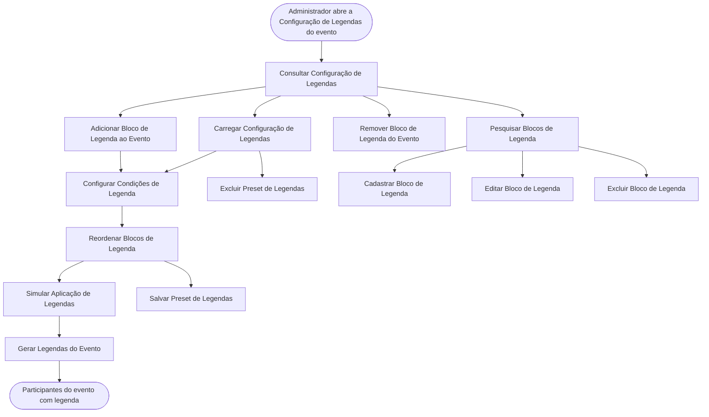

<!-- docqui: 3.0.1 | prompt: PROMPT_CONVERSION | atualizado: 2026-09-30 -->
# Feature Set: Legendas
> **Nível 2** - Major Feature Set: Eventos - `EVT-LEG`

## Descrição

Reúne a classificação dos participantes por legenda. A legenda é uma categoria com nome e cor — Anfitrião, Palestrantes, Diretores da CNI — que identifica o participante na lista e no mapa de assentos. O Administrador mantém um **catálogo** de blocos de legenda, comum a todos os eventos, e em cada evento monta a **configuração**: escolhe os blocos, põe-nos em ordem de prioridade e define as **condições** que dizem quem recebe cada legenda. Antes de aplicar, pode **simular**; ao **gerar**, o sistema atribui as legendas aos participantes do evento. Uma configuração pode ser guardada como **preset** e reaproveitada em outro evento. Corresponde ao documento legado **GPE006 – Gerenciar Regras de Legendas**, reformulado pelo ticket `PDTIC25148-34` (Configuração de Legendas por Evento, em teste).

**Não faz**: a atribuição manual de legenda a um participante (Feature Set Participantes), a exibição das legendas na lista e no mapa (Feature Set Participantes), a ativação e a inativação de legenda dentro do evento — GPE006 as descreve 📄, mas hoje o bloco que não deve valer é removido da configuração 💻 — e a reinicialização das regras numa só ação: o "Resetar" de GPE006 ⚠️ não existe mais.

---

## Features

| Feature | Descrição |
|---|---|
| [**Consultar Configuração de Legendas**](f-consultar-configuracao-legendas.md) <small>EVT-LEG-01</small> | Ver os blocos de legenda configurados no evento, em ordem, com as condições de cada um |
| [**Adicionar Bloco de Legenda ao Evento**](f-adicionar-bloco-legenda.md) <small>EVT-LEG-02</small> | Trazer para a configuração do evento um ou mais blocos do catálogo |
| [**Configurar Condições de Legenda**](f-configurar-condicoes-legenda.md) <small>EVT-LEG-03</small> | Definir, em um bloco do evento, as condições de campo, operador e valor que decidem quem recebe a legenda |
| [**Reordenar Blocos de Legenda**](f-reordenar-blocos-legenda.md) <small>EVT-LEG-04</small> | Mudar a posição de um bloco na configuração, alterando a prioridade das legendas |
| [**Remover Bloco de Legenda do Evento**](f-remover-bloco-legenda.md) <small>EVT-LEG-05</small> | Tirar um bloco da configuração do evento, sem excluí-lo do catálogo |
| [**Simular Aplicação de Legendas**](f-simular-aplicacao-legendas.md) <small>EVT-LEG-06</small> | Ver quantas e quais pessoas receberiam cada legenda, sem alterar nada |
| [**Gerar Legendas do Evento**](f-gerar-legendas-evento.md) <small>EVT-LEG-07</small> | Aplicar a configuração, recriando as legendas dos participantes do evento e preservando as manuais |
| [**Salvar Preset de Legendas**](f-salvar-preset-legendas.md) <small>EVT-LEG-08</small> | Guardar com um nome a configuração atual do evento, para reúso |
| [**Carregar Configuração de Legendas**](f-carregar-configuracao-legendas.md) <small>EVT-LEG-09</small> | Trazer para o evento a configuração de um preset ou de outro evento, substituindo ou mesclando |
| [**Excluir Preset de Legendas**](f-excluir-preset-legendas.md) <small>EVT-LEG-10</small> | Retirar um preset da biblioteca, sem afetar os eventos em que já foi aplicado |
| [**Pesquisar Blocos de Legenda**](f-pesquisar-blocos-legenda.md) <small>EVT-LEG-11</small> | Localizar blocos do catálogo pelo nome |
| [**Cadastrar Bloco de Legenda**](f-cadastrar-bloco-legenda.md) <small>EVT-LEG-12</small> | Incluir no catálogo um bloco com nome e cor, disponível a todos os eventos |
| [**Editar Bloco de Legenda**](f-editar-bloco-legenda.md) <small>EVT-LEG-13</small> | Alterar o nome ou a cor de um bloco do catálogo, com reflexo nos eventos que o usam |
| [**Excluir Bloco de Legenda**](f-excluir-bloco-legenda.md) <small>EVT-LEG-14</small> | Retirar um bloco do catálogo, das configurações dos eventos e das legendas dos participantes |

---

## Fluxo Principal

---

## Dependências entre features

- Todas as features de configuração partem da tela de **Consultar Configuração de Legendas**, aberta pelo ícone Configuração de Legendas da lista de eventos (Feature Set [Cadastro de Eventos](../cadastro-eventos/README.md)).
- A configuração é **gravada a cada alteração** — não há botão de salvar. **Adicionar Bloco de Legenda ao Evento**, **Remover Bloco de Legenda do Evento**, **Reordenar Blocos de Legenda**, **Configurar Condições de Legenda** e **Carregar Configuração de Legendas** gravam a configuração inteira do evento no momento em que são concluídas. 💻
- **Adicionar Bloco de Legenda ao Evento** depende de o bloco existir no catálogo. Quando não existe, a própria janela oferece criá-lo — é **Cadastrar Bloco de Legenda** acionada de dentro da configuração, seguida da adição ao evento.
- **Configurar Condições de Legenda** é o que põe o bloco para trabalhar: bloco sem nenhuma condição completa é ignorado na simulação e na geração.
- **Simular Aplicação de Legendas** e **Gerar Legendas do Evento** usam a mesma avaliação; simular não grava nada. Da janela da simulação pode-se seguir direto para gerar.
- **Gerar Legendas do Evento** preserva o que **Alterar Legenda do Participante** `EVT-PAR-05` atribuiu manualmente, no Feature Set [Participantes](../participantes/README.md).
- **Salvar Preset de Legendas** alimenta a biblioteca que **Carregar Configuração de Legendas** consulta e de onde **Excluir Preset de Legendas** retira. A exclusão do preset fica na mesma janela do carregamento.
- **Pesquisar Blocos de Legenda** abre o catálogo, onde ficam **Cadastrar Bloco de Legenda**, **Editar Bloco de Legenda** e **Excluir Bloco de Legenda**. O que se faz no catálogo reflete em todos os eventos que usam o bloco.
- As condições avaliam dados do domínio Pessoas — grupo de trabalho, papel desempenhado, tema, cargo e nome fantasia —, trazidos pelas cargas do Feature Set [Cadastro de Pessoas](../../pessoas/cadastro-pessoas/README.md).

---

## Telas

| Tela | Rota sugerida | Features atendidas | Descrição |
|---|---|---|---|
| Configuração de Legendas | `/regras-legenda/:eventoId` | **Consultar Configuração de Legendas** <small>EVT-LEG-01</small> **Configurar Condições de Legenda** <small>EVT-LEG-03</small> **Reordenar Blocos de Legenda** <small>EVT-LEG-04</small> **Remover Bloco de Legenda do Evento** <small>EVT-LEG-05</small> **Gerar Legendas do Evento** <small>EVT-LEG-07</small> | Um cartão por bloco, com número, cor, nome e condições, e a barra de ações |
| Adicionar bloco | janela sobre a Configuração de Legendas | **Adicionar Bloco de Legenda ao Evento** <small>EVT-LEG-02</small> **Cadastrar Bloco de Legenda** <small>EVT-LEG-12</small> | Abas Usar bloco existente e Criar novo bloco |
| Simulação de aplicação de legendas | janela sobre a Configuração de Legendas | **Simular Aplicação de Legendas** <small>EVT-LEG-06</small> | Totais e, por legenda, a quantidade e os nomes dos participantes |
| Salvar como preset | janela sobre a Configuração de Legendas | **Salvar Preset de Legendas** <small>EVT-LEG-08</small> | Nome e descrição do preset |
| Carregar configuração | janela sobre a Configuração de Legendas | **Carregar Configuração de Legendas** <small>EVT-LEG-09</small> **Excluir Preset de Legendas** <small>EVT-LEG-10</small> | Modo de aplicação e as abas Biblioteca de presets e De outro evento |
| Catálogo de blocos | `/catalogo-legendas` | **Pesquisar Blocos de Legenda** <small>EVT-LEG-11</small> **Cadastrar Bloco de Legenda** <small>EVT-LEG-12</small> **Editar Bloco de Legenda** <small>EVT-LEG-13</small> **Excluir Bloco de Legenda** <small>EVT-LEG-14</small> | Busca pelo nome, lista de blocos com cor e as ações de cada linha |

---

## Permissões por perfil

> **Fonte única de permissões** deste Feature Set. As features (N3) não tratam de
> perfis nem permissões — qualquer acesso novo ou diferente entra nesta matriz.

Perfis: **Administrador**, **Secretaria Mesa**, **Secretaria Check-In**.

### Configuração do evento

| Perfil | Consultar Configuração | Adicionar Bloco | Configurar Condições | Reordenar | Remover Bloco | Simular | Gerar Legendas |
|---|---|---|---|---|---|---|---|
| **Administrador** | ✓ | ✓ | ✓ | ✓ | ✓ | ✓ | ✓ |
| **Secretaria Mesa** | — | — | — | — | — | — | — |
| **Secretaria Check-In** | — | — | — | — | — | — | — |

### Presets e catálogo

| Perfil | Salvar Preset | Carregar Configuração | Excluir Preset | Pesquisar Blocos | Cadastrar Bloco | Editar Bloco | Excluir Bloco |
|---|---|---|---|---|---|---|---|
| **Administrador** | ✓ | ✓ | ✓ | ✓ | ✓ | ✓ | ✓ |
| **Secretaria Mesa** | — | — | — | — | — | — | — |
| **Secretaria Check-In** | — | — | — | — | — | — | — |

* **Administrador** — único perfil que configura legendas, conforme GPE006.
* ⚠️ As telas de legendas **não conferem o perfil** 💻: o que as esconde dos demais é o menu, que só traz o Catálogo de legendas para o Administrador, e a lista de eventos, de onde se chega à configuração. No servidor, a consulta ao catálogo e à configuração está declarada para os três perfis — a Secretaria Check-In e a Secretaria Mesa precisam dela para ver as legendas na lista e no mapa —, e toda inclusão, alteração e exclusão, só para o Administrador.
* ⚠️ **Simular** é declarada no servidor como inclusão sob o recurso de eventos, portanto só para o Administrador, embora não grave nada 💻.

---

## Changelog

<!-- Ordem decrescente por data: a entrada mais recente fica sempre no topo, logo abaixo do cabeçalho. -->

| Data | Autor | Tipo | Descrição |
|---|---|---|---|
| 2026-09-30 | Claude (analista-requisitos) | N2 criado | Engenharia reversa do documento legado GPE006 – Gerenciar Regras de Legendas (v1.0, 03/10/2025), do código das telas e do motor de legendas, e do ticket `PDTIC25148-34` (Configuração de Legendas por Evento, em teste), que reformulou o modelo descrito no documento |

---

*Links: [N1 do domínio](../README.md) · [INDEX geral](../../INDEX.md)*
