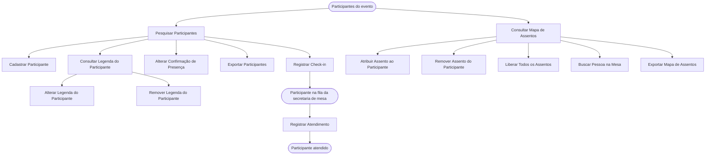

<!-- docqui: 3.0.1 | prompt: PROMPT_CONVERSION | atualizado: 2026-09-30 -->
# Feature Set: Participantes
> **Nível 2** - Major Feature Set: Eventos - `EVT-PAR`

## Descrição

Reúne o que acontece com os participantes de um evento, antes e durante a sua realização. Na **lista de participantes**, localiza-se a pessoa, registra-se o check-in, ajusta-se a confirmação de presença, inclui-se quem chegou sem estar na lista e trata-se a legenda de cada um. No **mapa de assentos**, o Administrador distribui os participantes pelos lugares da mesa, e a Secretaria Mesa acompanha quem já chegou, localiza o assento e marca quem foi atendido. Lista e mapa podem ser exportados. Corresponde ao documento legado **GPE005 – Gerenciar Participante**.

**Não faz**: a formação da lista de participantes por planilha ou pelo CRM (Feature Set Cadastro de Eventos), a configuração e a geração das legendas por regra (Feature Set Legendas), a manutenção completa dos dados da pessoa (domínio Pessoas) e a marcação individual de convidado — esse indicador só é gravado pelas cargas e pela importação do CRM 💻.

---

## Features

| Feature | Descrição |
|---|---|
| [**Pesquisar Participantes**](f-pesquisar-participantes.md) <small>EVT-PAR-01</small> | Localizar as pessoas de um evento por nome, organização, cargo, legenda, tema, grupo de trabalho ou situação de convite, confirmação e check-in |
| [**Cadastrar Participante**](f-cadastrar-participante.md) <small>EVT-PAR-02</small> | Incluir no evento, na recepção, uma pessoa que não estava na lista, criando também o seu cadastro |
| [**Registrar Check-in**](f-registrar-check-in.md) <small>EVT-PAR-03</small> | Marcar a chegada do participante ao evento, ou desfazer a marcação |
| [**Consultar Legenda do Participante**](f-consultar-legenda-participante.md) <small>EVT-PAR-04</small> | Ver a legenda atribuída manualmente a um participante e as legendas do catálogo disponíveis para ele |
| [**Alterar Legenda do Participante**](f-alterar-legenda-participante.md) <small>EVT-PAR-05</small> | Atribuir manualmente uma legenda ao participante, no lugar da que ele tem |
| [**Remover Legenda do Participante**](f-remover-legenda-participante.md) <small>EVT-PAR-06</small> | Retirar a legenda atribuída manualmente ao participante |
| [**Consultar Mapa de Assentos**](f-consultar-mapa-assentos.md) <small>EVT-PAR-07</small> | Ver todos os assentos do evento, com o participante de cada um, e a lista de pessoas disponíveis |
| [**Atribuir Assento ao Participante**](f-atribuir-assento-participante.md) <small>EVT-PAR-08</small> | Colocar um participante em um assento do mapa |
| [**Remover Assento do Participante**](f-remover-assento-participante.md) <small>EVT-PAR-09</small> | Tirar um participante do assento, devolvendo-o à lista de pessoas disponíveis |
| [**Registrar Atendimento**](f-registrar-atendimento.md) <small>EVT-PAR-10</small> | Marcar que o participante que chegou já foi atendido pela secretaria de mesa |
| [**Liberar Todos os Assentos**](f-liberar-assentos.md) <small>EVT-PAR-11</small> | Esvaziar o mapa, tirando todos os participantes dos seus assentos |
| [**Buscar Pessoa na Mesa**](f-buscar-pessoa-mesa.md) <small>EVT-PAR-12</small> | Localizar no mapa o assento de uma pessoa já alocada, com destaque visual |
| [**Alterar Confirmação de Presença**](f-alterar-confirmacao-presenca.md) <small>EVT-PAR-13</small> | Retirar, ou repor, a confirmação de presença de um participante |
| [**Exportar Participantes**](f-exportar-participantes.md) <small>EVT-PAR-14</small> | Baixar em planilha o resultado da pesquisa de participantes |
| [**Exportar Mapa de Assentos**](f-exportar-mapa-assentos.md) <small>EVT-PAR-15</small> | Baixar o mapa completo, ou só a mesa principal, em PDF ou imagem 💻 |

---

## Fluxo Principal

---

## Dependências entre features

- A tela tem duas visões, **Participantes** e **Mapa de Assentos**. O Administrador alterna entre elas; a Secretaria Check-In só tem a lista; a Secretaria Mesa só tem o mapa, numa versão de consulta. 💻
- **Cadastrar Participante**, **Registrar Check-in**, **Alterar Confirmação de Presença**, **Exportar Participantes** e **Consultar Legenda do Participante** partem da lista de **Pesquisar Participantes**.
- **Alterar Legenda do Participante** e **Remover Legenda do Participante** acontecem dentro da janela aberta por **Consultar Legenda do Participante**. ⚠️ Essa janela mostra só a legenda **manual**: quem tem legenda apenas por regra aparece nela como sem legenda, embora a lista e o mapa o identifiquem pela legenda gerada 💻.
- O mapa só reúne quem está confirmado ou fez check-in. Por isso **Cadastrar Participante** sem o check-in automático deixa a pessoa fora do mapa, e retirar a confirmação em **Alterar Confirmação de Presença** tira o participante dele. 💻
- A lista de participantes **não** se atualiza sozinha: só muda ao pesquisar, limpar ou trocar de página. A atualização automática, a cada 3 segundos, vale para os participantes do mapa. 💻
- **Atribuir Assento ao Participante**, **Remover Assento do Participante**, **Liberar Todos os Assentos**, **Buscar Pessoa na Mesa** e **Exportar Mapa de Assentos** acontecem sobre o mapa de **Consultar Mapa de Assentos**.
- **Atribuir Assento ao Participante**, **Remover Assento do Participante** e **Liberar Todos os Assentos** não têm operação própria no servidor: concluem-se pela **gravação do mapa inteiro** — automática, 30 segundos depois da última alteração, ou imediata pelo botão Salvar Alocações —, descrita em `EVT-PAR-08`. 💻
- ⚠️ Três efeitos dessa gravação precisam de decisão 💻: (1) **Liberar Todos os Assentos** e a retirada do último participante sentado **não são gravadas** — a tela esvazia o mapa, mas a gravação automática desiste quando não há ninguém sentado; (2) gravar o mapa apaga a data do check-in e os dados vindos do CRM de quem está sentado, e pode desfazer o atendimento registrado pela Secretaria Mesa; (3) uma alteração ainda não gravada é descartada quando chega a atualização automática com mudança feita em outro ponto, como um check-in.
- **Registrar Check-in** alimenta a fila da Secretaria Mesa: quem fez check-in e ainda não foi atendido aparece na lista de pessoas disponíveis dela, em ordem de chegada; **Registrar Atendimento** tira a pessoa dessa lista.
- O mapa do Administrador e o da Secretaria Mesa mostram listas de pessoas disponíveis **diferentes**: para o Administrador, quem ainda não tem assento; para a Secretaria Mesa, quem fez check-in e ainda não foi atendido, tenha ou não assento. 💻
- **Alterar Confirmação de Presença** interfere nas outras: retirar a confirmação libera o assento do participante, e qualquer alteração de confirmação desfaz o check-in de quem já o tinha. → ver [N1 Eventos](../README.md): Regras transversais de negócio: 6 e 7
- A legenda que aparece na lista e as cores do mapa vêm do Feature Set [Legendas](../legendas/README.md); a legenda manual tratada aqui prevalece sobre a gerada por regra.
- Os participantes chegam a esta tela pelas cargas e pela importação do Feature Set [Cadastro de Eventos](../cadastro-eventos/README.md).

---

## Telas

| Tela | Rota sugerida | Features atendidas | Descrição |
|---|---|---|---|
| Participantes do evento — lista | `/evento-pessoa/:id` | **Pesquisar Participantes** <small>EVT-PAR-01</small> **Registrar Check-in** <small>EVT-PAR-03</small> **Alterar Confirmação de Presença** <small>EVT-PAR-13</small> **Exportar Participantes** <small>EVT-PAR-14</small> | Cabeçalho com os dados do evento, filtros e lista de participantes com a cor da legenda |
| Cadastrar Pessoa | janela aberta pelo botão do cabeçalho, na lista e no mapa do Administrador | **Cadastrar Participante** <small>EVT-PAR-02</small> | Nome, instituição, cargo, e-mail e a opção de check-in automático |
| Gerenciar Legenda da Pessoa | janela sobre a lista, aberta pela coluna Assento | **Consultar Legenda do Participante** <small>EVT-PAR-04</small> **Alterar Legenda do Participante** <small>EVT-PAR-05</small> **Remover Legenda do Participante** <small>EVT-PAR-06</small> | Dados do participante, a legenda manual atual e a lista de legendas do catálogo para escolha |
| Mapa de assentos — Administrador | `/evento-pessoa/:id`, visão Mapa de Assentos | **Consultar Mapa de Assentos** <small>EVT-PAR-07</small> **Atribuir Assento ao Participante** <small>EVT-PAR-08</small> **Remover Assento do Participante** <small>EVT-PAR-09</small> **Liberar Todos os Assentos** <small>EVT-PAR-11</small> **Buscar Pessoa na Mesa** <small>EVT-PAR-12</small> **Exportar Mapa de Assentos** <small>EVT-PAR-15</small> | Pessoas disponíveis, mapa com os setores A a H, legenda das categorias e exportações |
| Mapa de assentos — Secretaria Mesa | `/evento-pessoa/:id`, aberta direto no mapa | **Consultar Mapa de Assentos** <small>EVT-PAR-07</small> **Buscar Pessoa na Mesa** <small>EVT-PAR-12</small> **Registrar Atendimento** <small>EVT-PAR-10</small> | Fila de quem fez check-in, com foto e assento, e o mapa só para consulta, atualizado automaticamente |

---

## Permissões por perfil

> **Fonte única de permissões** deste Feature Set. As features (N3) não tratam de
> perfis nem permissões — qualquer acesso novo ou diferente entra nesta matriz.

Perfis: **Administrador**, **Secretaria Mesa**, **Secretaria Check-In**.

### Lista de participantes

| Perfil | Pesquisar | Cadastrar | Registrar Check-in | Alterar Confirmação | Exportar Participantes |
|---|---|---|---|---|---|
| **Administrador** | ✓ | ✓ | ✓ | ✓ | ✓ |
| **Secretaria Mesa** | — | — | — | — | — |
| **Secretaria Check-In** | ✓ (só o evento principal; sem os filtros Temas, Grupos de Trabalho e Cargo) | ✓ | ✓ | — | ✓ 💻 |

### Legenda do participante

| Perfil | Consultar Legenda | Alterar Legenda | Remover Legenda |
|---|---|---|---|
| **Administrador** | ✓ | ✓ | ✓ |
| **Secretaria Mesa** | — | — | — |
| **Secretaria Check-In** | — | — | — |

### Mapa de assentos

| Perfil | Consultar Mapa | Atribuir Assento | Remover Assento | Liberar Todos | Buscar Pessoa na Mesa | Registrar Atendimento | Exportar Mapa |
|---|---|---|---|---|---|---|---|
| **Administrador** | ✓ | ✓ | ✓ | ✓ | ✓ | — | ✓ 💻 |
| **Secretaria Mesa** | ✓ (só o evento principal; só consulta) | — | — | — | ✓ | ✓ | — |
| **Secretaria Check-In** | — | — | — | — | — | — | — |

* **Administrador** — prepara e ajusta o evento: tudo, exceto registrar atendimento, que é da secretaria de mesa.
* **Secretaria Check-In** — recebe os participantes: pesquisa, cadastra quem não estava na lista e registra o check-in.
* **Secretaria Mesa** — conduz aos lugares: consulta o mapa, busca a pessoa e registra o atendimento.
* A matriz segue GPE005 📄, com três acréscimos que só o código mostra 💻: Exportar Participantes está disponível à Secretaria Check-In; Exportar Mapa de Assentos não consta no documento; e Alterar Confirmação de Presença, que o documento não traz na matriz, é só do Administrador.
* ⚠️ **Servidor e interface não coincidem** 💻. O cadastro corporativo do sistema declara toda alteração sob o recurso de eventos só para o Administrador — o que inclui o **cadastro de participante na recepção**, que a interface oferece à Secretaria Check-In. O check-in da Secretaria Check-In usa uma operação própria, declarada só para esse perfil. Já a pesquisa de participantes e o **registro de atendimento** ficam num recurso que não consta entre os protegidos. O que vale em produção depende do que o cadastro corporativo devolve ❓.
* ⚠️ A interface trata como Administrador qualquer perfil que não seja Secretaria Mesa nem Secretaria Check-In — exceto na confirmação de presença, que confere o nome Administrador 💻. O código cita ainda um perfil **Gestor**, que não existe no cadastro corporativo do sistema.

---

## Changelog

<!-- Ordem decrescente por data: a entrada mais recente fica sempre no topo, logo abaixo do cabeçalho. -->

| Data | Autor | Tipo | Descrição |
|---|---|---|---|
| 2026-09-30 | Claude (analista-requisitos) | N2 criado | Engenharia reversa do documento legado GPE005 – Gerenciar Participante (v1.1, 16/12/2025), do código da lista de participantes e do mapa de assentos, e do ticket `PDTIC25148-35` (melhorias na listagem, em teste) |

---

*Links: [N1 do domínio](../README.md) · [INDEX geral](../../INDEX.md)*
