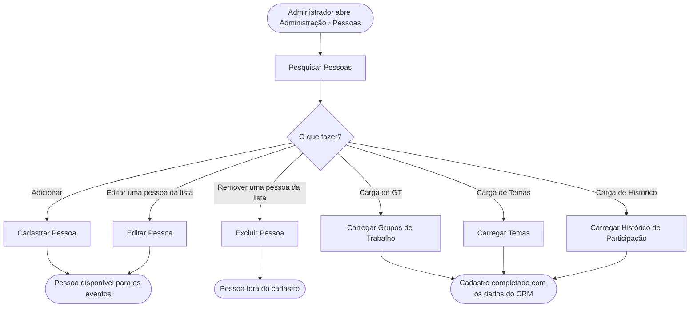

<!-- docqui: 3.0.1 | prompt: PROMPT_CONVERSION | atualizado: 2026-09-30 -->
# Feature Set: Cadastro de Pessoas
> **Nível 2** - Major Feature Set: Pessoas - `PES-CAD`

## Descrição

Reúne a manutenção das pessoas que podem ser convidadas para os eventos: localizar uma pessoa, incluí-la com seus dados pessoais, de contato e da organização que representa, alterar esses dados e excluí-la. Reúne também as três cargas de planilha que completam o cadastro com o que vem do CRM — os grupos de trabalho de que a pessoa participa, os temas a que se vincula e o histórico de participação em eventos. Corresponde ao documento legado **GPE003 – Manter Pessoa**.

**Não faz**: o vínculo da pessoa com um evento e as cargas de convidados e de confirmados (Feature Set Cadastro de Eventos), o cadastro de pessoa na recepção do evento (Feature Set Participantes), a edição na tela dos grupos de trabalho, dos temas e do histórico — só entram por carga e são exibidos para consulta — e a manutenção dos usuários do sistema (domínio Acesso e Usuários).

---

## Features

| Feature | Descrição |
|---|---|
| [**Pesquisar Pessoas**](f-pesquisar-pessoas.md) <small>PES-CAD-01</small> | Localizar pessoas por nome, CRM, razão social ou e-mail |
| [**Cadastrar Pessoa**](f-cadastrar-pessoa.md) <small>PES-CAD-02</small> | Incluir uma pessoa com dados pessoais, contatos e perfil corporativo |
| [**Editar Pessoa**](f-editar-pessoa.md) <small>PES-CAD-03</small> | Alterar os dados de uma pessoa e consultar seus grupos de trabalho, temas e histórico |
| [**Excluir Pessoa**](f-excluir-pessoa.md) <small>PES-CAD-04</small> | Retirar do cadastro a pessoa que não participa de nenhum evento |
| [**Carregar Grupos de Trabalho**](f-carregar-grupos-trabalho.md) <small>PES-CAD-05</small> | Trazer de uma planilha os grupos de trabalho das pessoas e o papel de cada uma |
| [**Carregar Temas**](f-carregar-temas.md) <small>PES-CAD-06</small> | Trazer de uma planilha os temas a que as pessoas se vinculam |
| [**Carregar Histórico de Participação**](f-carregar-historico-participacao.md) <small>PES-CAD-07</small> | Trazer de uma planilha quantas vezes cada pessoa participou de eventos, ano a ano |

---

## Fluxo Principal

---

## Dependências entre features

- Todas as demais features partem da tela de **Pesquisar Pessoas**: Adicionar abre o cadastro; as ações de cada linha abrem a edição e a exclusão; os três botões de carga abrem as janelas de carga.
- **Cadastrar Pessoa** e **Editar Pessoa** usam o mesmo formulário, organizado em abas. As abas Relacionamento e Histórico só têm conteúdo depois que as cargas trouxeram dados para aquela pessoa.
- As três cargas dependem de a pessoa **já existir** com o `Cód. Contato` preenchido no campo CRM — elas não criam pessoas. Quem cria pessoas a partir de planilha são as cargas de convidados e de confirmados, do Feature Set [Cadastro de Eventos](../../eventos/cadastro-eventos/README.md).
- **Excluir Pessoa** depende de a pessoa não participar de nenhum evento.
- O que as cargas trazem é consumido pelo domínio Eventos: grupo de trabalho, papel, tema, cargo e nome fantasia são avaliados pelas condições de legenda, e o histórico acompanha o nome no mapa de assentos.

---

## Telas

| Tela | Rota sugerida | Features atendidas | Descrição |
|---|---|---|---|
| Pessoas | `/administracao-pessoas` | **Pesquisar Pessoas** <small>PES-CAD-01</small> **Excluir Pessoa** <small>PES-CAD-04</small> | Filtros, lista de pessoas, as ações Editar Pessoa e Remover Pessoa em cada linha e os botões Adicionar, Carga de GT, Carga de Temas e Carga de Histórico |
| Pessoa | `/administracao-pessoa` (inclusão) e `/administracao-pessoa/:id` (edição) | **Cadastrar Pessoa** <small>PES-CAD-02</small> **Editar Pessoa** <small>PES-CAD-03</small> | Formulário em cinco abas: Cadastro, Contatos, Perfil Corporativo, Relacionamento e Histórico — as duas últimas só para consulta |
| Carga de Grupos Temáticos | janela sobre a tela Pessoas | **Carregar Grupos de Trabalho** <small>PES-CAD-05</small> | Seleção da planilha e botão Enviar |
| Carga de Temas | janela sobre a tela Pessoas | **Carregar Temas** <small>PES-CAD-06</small> | Seleção da planilha e botão Enviar |
| Carga de Histórico | janela sobre a tela Pessoas | **Carregar Histórico de Participação** <small>PES-CAD-07</small> | Seleção da planilha e botão Enviar |

---

## Permissões por perfil

> **Fonte única de permissões** deste Feature Set. As features (N3) não tratam de
> perfis nem permissões — qualquer acesso novo ou diferente entra nesta matriz.

Perfis: **Administrador**, **Secretaria Mesa**, **Secretaria Check-In**.

| Perfil | Pesquisar | Cadastrar | Editar | Excluir | Carregar GT | Carregar Temas | Carregar Histórico |
|---|---|---|---|---|---|---|---|
| **Administrador** | ✓ | ✓ | ✓ | ✓ | ✓ | ✓ | ✓ |
| **Secretaria Mesa** | — | — | — | — | — | — | — |
| **Secretaria Check-In** | — | — | — | — | — | — | — |

* **Administrador** — único perfil com acesso ao cadastro de pessoas, conforme GPE003.
* ⚠️ O que impede os demais perfis é o **menu**, que só traz Administração › Pessoas para o Administrador. A tela não confere o perfil, e no servidor o recurso de pessoas **não consta** entre os recursos protegidos declarados no cadastro corporativo do sistema — o que deixaria pesquisa, inclusão, alteração, exclusão e as três cargas sem conferência de credencial 💻. O que vale em produção depende do que o cadastro corporativo devolve, e o código não permite confirmar ❓.
* ⚠️ Na lista de participantes de um evento, o nome da pessoa é um atalho que abre a tela Pessoa em outra aba, para qualquer perfil que veja a lista — inclusive a Secretaria Check-In 💻 (`PDTIC25148-35`).

---

## Changelog

<!-- Ordem decrescente por data: a entrada mais recente fica sempre no topo, logo abaixo do cabeçalho. -->

| Data | Autor | Tipo | Descrição |
|---|---|---|---|
| 2026-09-30 | Claude (analista-requisitos) | N2 criado | Engenharia reversa do documento legado GPE003 – Manter Pessoa (v1.0, 03/10/2025) e do código das telas e das cargas de pessoa |

---

*Links: [N1 do domínio](../README.md) · [INDEX geral](../../INDEX.md)*
